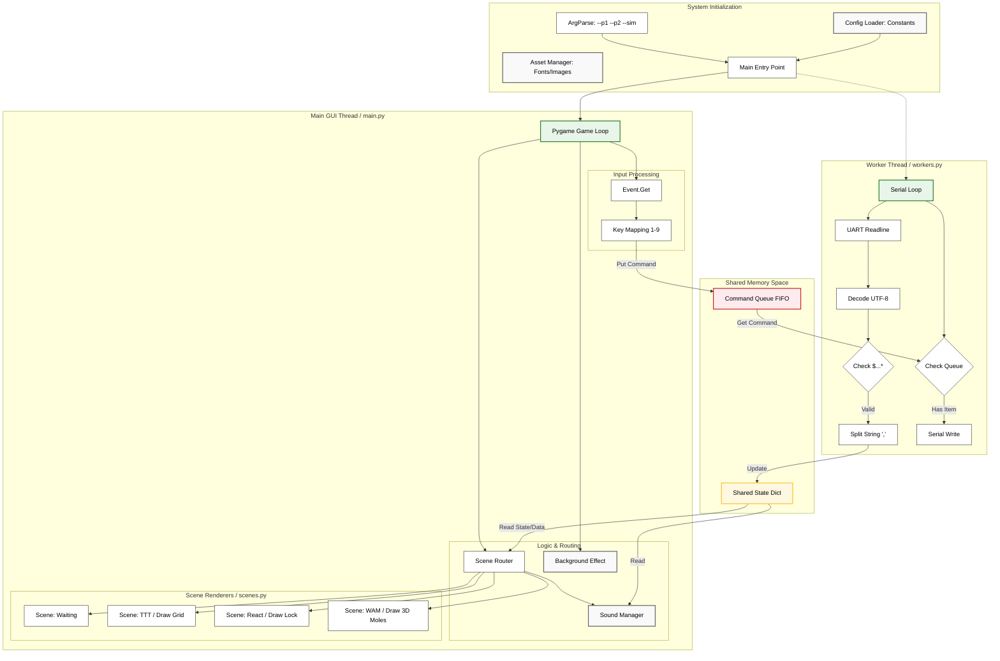

# PIC18F HMI Interactive Gaming Console

[Platform](https://img.shields.io/badge/Platform-PIC18F4520-blue)

[Language](https://img.shields.io/badge/Language-C%20%7C%20Python-green)

## Project Overview

This project implements a complete Interactive Gaming System. The core system utilizes a **PIC18F4520** microcontroller for real-time logic processing and hardware control, while the host system employs Python (Pygame) for visual rendering and audio processing.

By implementing a custom **UART Communication Protocol**, the system achieves millisecond-level bidirectional interaction between the MCU and PC, demonstrating a comprehensive integration of low-level driver development, interrupt control, and high-level multithreaded software architecture.

---

## Features

### 1. Firmware (PIC18F)

- **Interrupt**: Implemented Nested Interrupts, assigning High Priority to button events for immediate response and Low Priority to communication and timing logic.
- **Peripheral Integration**: seamless integration of **ADC (Variable Resistor)**, **Timer (System Clock)**, **External Interrupts (Buttons)**, and **UART** modules.
- **Finite State Machine**: Utilized FSM to manage game flow and state transitions.

### 2. Software (PC Host)

- **Multithreaded Architecture**: Adopts a Producer-Consumer model to decouple I/O communication from GUI rendering, ensuring a stable **60 FPS** frame rate without blocking.
- **Passive Rendering Engine**: The PC software functions strictly as a visualization layer. All core game logic, state management, and win/loss determinations are executed exclusively on the **PIC18F4520**, ensuring the microcontroller remains the true brain of the system.

---

## Games

The system includes three interactive game modes, with logic controlled by the PIC and display handled by the PC:

1. **TIC-TAC-TOE**
    - **Controls**: Use Variable Resistor (VR) to control cursor movement; Button to confirm placement.
    - **Logic**: PIC calculates win/loss conditions and draw states.
2. **REACTION GAME**
    - **Controls**: Two-player reaction test using buttons.
    - **Logic**: Players must stop a rapidly incrementing counter at a specific target. PIC calculates accuracy.
3. **WHAC-A-MOLE)**
    - **Controls**: Players 1 & 2 use buttons to initialize; **PC Keyboard (1-9)** used for attacking.
    - **Logic**: PC keyboard signals are transmitted via UART to the PIC, where hit detection and scoring are processed.

---

```
.
├── Docs
│   ├── Protocol.md             # Serial communication protocol specification
│   ├── UI.md                   # User Interface design docs
│   └── UI_Setup.md             # Setup guide for python environment
├── Final_Proj.X
│   ├── build
│   │   └── default
│   │       └── debug
│   │           └── _ext
│   │               └── 984248410
│   │                   ├── GAME_OUTPUT.i
│   │                   ├── GAME_OUTPUT.p1
│   │                   ├── GAME_OUTPUT.p1.d
│   │                   ├── main.i
│   │                   ├── main.p1
│   │                   ├── main.p1.d
│   │                   ├── REACTION_GAME.i
│   │                   ├── REACTION_GAME.p1
│   │                   ├── REACTION_GAME.p1.d
│   │                   ├── TIC_TAC_TOE.i
│   │                   ├── TIC_TAC_TOE.p1
│   │                   ├── TIC_TAC_TOE.p1.d
│   │                   ├── uart.i
│   │                   ├── uart.p1
│   │                   ├── uart.p1.d
│   │                   ├── WHAC_A_MOLE.i
│   │                   ├── WHAC_A_MOLE.p1
│   │                   └── WHAC_A_MOLE.p1.d
│   ├── debug
│   │   └── default
│   ├── dist
│   │   └── default
│   │       └── debug
│   │           ├── doprnt.d
│   │           ├── doprnt.i
│   │           ├── doprnt.p1
│   │           ├── Final_Proj.X.debug.cmf
│   │           ├── Final_Proj.X.debug.elf
│   │           ├── Final_Proj.X.debug.hxl
│   │           ├── Final_Proj.X.debug.lst
│   │           ├── Final_Proj.X.debug.map
│   │           ├── Final_Proj.X.debug.mum
│   │           ├── Final_Proj.X.debug.o
│   │           ├── Final_Proj.X.debug.rlf
│   │           ├── Final_Proj.X.debug.sdb
│   │           ├── Final_Proj.X.debug.sym
│   │           └── memoryfile.xml
│   ├── GAME_OUTPUT.c           # Handles formatting data output to PC
│   ├── INTERFACE.h             # Common definitions and interface headers
│   ├── main.c                  # Main entry point for the microcontroller
│   ├── Makefile
│   ├── nbproject
│   │   ├── configurations.xml
│   │   ├── Makefile-default.mk
│   │   ├── Makefile-genesis.properties
│   │   ├── Makefile-impl.mk
│   │   ├── Makefile-local-default.mk
│   │   ├── Makefile-variables.mk
│   │   ├── Package-default.bash
│   │   ├── private
│   │   │   ├── configurations.xml
│   │   │   └── private.xml
│   │   └── project.xml
│   ├── REACTION_GAME.c         # Source logic for 'Reaction' game
│   ├── REACTION_GAME.h         # Header for 'Reaction' game
│   ├── TIC_TAC_TOE.c           # Source logic for 'Tic-Tac-Toe' game
│   ├── TIC_TAC_TOE.h           # Header for 'Tic-Tac-Toe' game
│   ├── uart.c                  # UART driver implementation
│   ├── uart.h                  # UART driver header
│   ├── WHAC_A_MOLE.c           # Source logic for 'Whac-A-Mole' game
│   └── WHAC_A_MOLE.h           # Header for 'Whac-A-Mole' game
└── UI
    ├── assets                  # Media resources (Audio/Images)
    │   ├── bgm.mp3
    │   ├── button.mp3
    │   ├── hint.mp3
    │   ├── hit.mp3
    │   ├── miss.mp3
    │   ├── move.mp3
    │   ├── place.mp3
    │   ├── tongtongtong.png
    │   └── win.mp3
    ├── config.py               # Global settings (screen size, serial settings)
    ├── main.py                 # Application entry point
    ├── managers.py             # Logic for managing game states
    ├── scenes.py               # Visual layout and logic for screens
    └── workers.py              # Background threads (Serial I/O reading)

```

## System Architecture (Firmware)


## System Architecture (Software)

